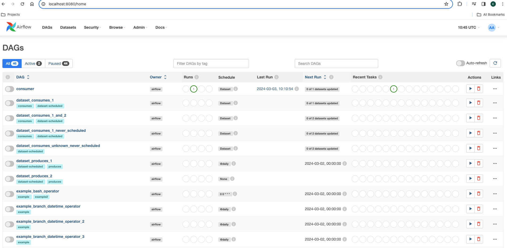
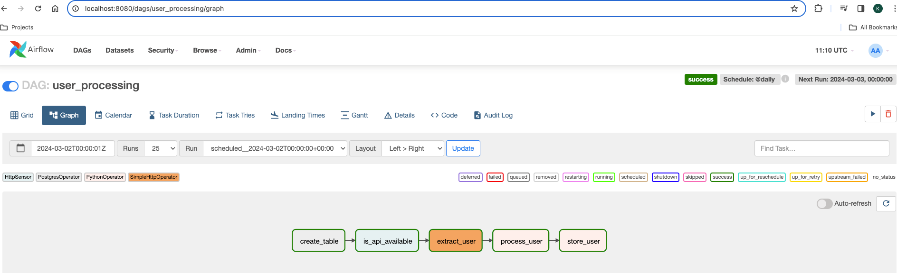
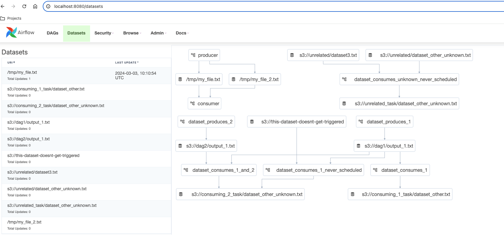
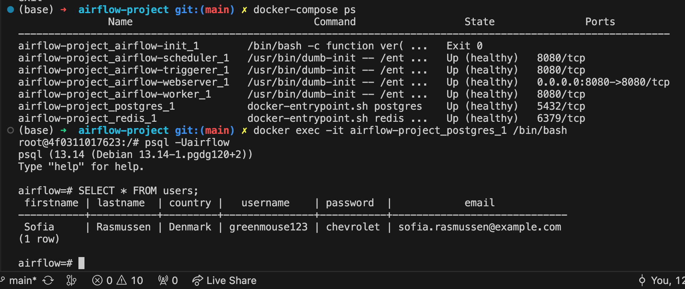

# Airflow
###### Note: Install Apache Airflow with Docker
## Build data pipeline steps:
1. Create a table with the Postgres separator to execute SQL requests in flow
2. Check if an API is available or not(more importantly)
3. Extract a user and process that user with one of the most popular operator
in flow.
4. Store user in the password database.

## Getting Started:
  1. Check .env file with values:
````
  AIRFLOW_IMAGE_NAME=apache/airflow:2.4.2
  AIRFLOW_UID=50000
````

  2. Run to start: docker-compose up -d

  3. Go to: localhost:8080, you'll see the Airflow UI:
  

  4. Add connection:
  <details>
  <summary>Details for set up connection</summary>
    * Click: Admin <br>
    * Click: Connections: <br>
      * Connection id: postgres <br>
      * Connection Type: Postgres <br>
      * Host: postgres <br>
      * Login: airflow <br>
      * Password: airflow <br>
      * Port: 5432 <br>
      * Save it <br>
  </details>  <br>

  5. Bring up project via below commands
````
  - run: docker-compose ps
  - run: docker exec -it airflow-project_airflow-scheduler_1 /bin/bash
  - run: airflow tasks test user_processing create_table 2022-01-01
  - run: docker-compose ps
  - run: docker exec -it airflow-project_airflow-worker_1 /bin/bash
  - run: ls /tmp/
  - run: docker exec -it airflow-project_postgres_1 /bin/bash
  - run: psql -Uairflow
  - run: SELECT * FROM users;
````




### Well done!

###### Debugging commands: 
````
  docker-compose ps
  docker volume prune
````