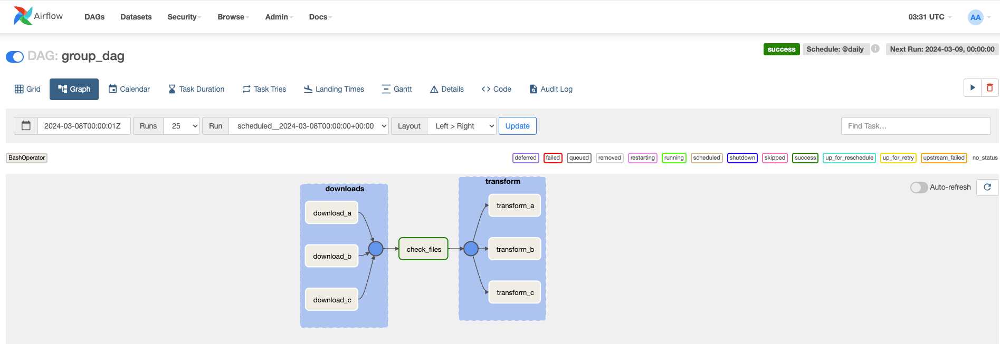

# Airflow
###### Note: Install Apache Airflow with Docker
## Build data pipeline steps:
1. Create a table with the Postgres separator to execute SQL requests in flow
2. Check if an API is available or not(more importantly)
3. Extract a user and process that user with one of the most popular operator
in flow.
4. Store user in the password database.

## Getting Started:
  1. Check .env file with values:
````
  AIRFLOW_IMAGE_NAME=apache/airflow:2.4.2
  AIRFLOW_UID=50000
````

  2. Run to start: docker-compose up -d

  3. Go to: localhost:8080, you'll see the Airflow UI:
  

  4. Add connection:
  <details>
  <summary>Details for set up connection</summary>
    * Click: Admin <br>
    * Click: Connections: <br>
      * Connection id: postgres <br>
      * Connection Type: Postgres <br>
      * Host: postgres <br>
      * Login: airflow <br>
      * Password: airflow <br>
      * Port: 5432 <br>
      * Save it <br>
  </details>  <br>

  5. Bring up project via below commands
````
  - run: docker-compose ps
  - run: docker exec -it airflow-project_airflow-scheduler_1 /bin/bash
  - run: airflow tasks test user_processing create_table 2022-01-01
  - run: docker-compose ps
  - run: docker exec -it airflow-project_airflow-worker_1 /bin/bash
  - run: ls /tmp/
  - run: docker exec -it airflow-project_postgres_1 /bin/bash
  - run: psql -Uairflow
  - run: SELECT * FROM users;
````


### Well done!

## DAG Graph UIs:
1. user_processing:

2. parallel_dag:


## Monitor tasks with Flower:
* run command: docker-compose down && docker-compose --profile flower up -d
* we can see our worker and tasks on Flower UI:


## Remove DAG examples, if you want to keep our Airflow instance nice and clean:
* AIRFLOW__CORE__LOAD_EXAMPLES: false

## Use task groups instead of the sub decks
* 
* 

## BranchPythonOperator: 
* returns the task IDs of the next task to execute if the condition is true or not.


## Add elastic plugin corresponds to 'elastic hook', and register plugin to project:
* file: /dags/plugins/hooks/elastic/elastic_hook.py
* local check:
  * run: docker-compose -f docker-compose-es.yaml ps
  * get into scheduler file, run: docker exec -it airflow-project_airflow-scheduler_1 /bin/bash
  * check plugin details, run: airflow plugins

* add below elastic DAG file:
```` { .lang #example style="color: #333; background: #f8f8f8;" }
  from airflow import DAG
  from airflow.operators.python import PythonOperator
  from hooks.elastic.elastic_hook import ElasticHook

  from datetime import datetime

  def _print_es_info():
    hook = ElasticHook()
    print(hook.info)

  with DAG('elastic_dag', start_date=datetime(2022, 1, 1),
          schedule_interval='@daily',
          catchup=False
          ) as dag:
    
    print_es_info = PythonOperator(
      task_id='print_es_info',
      python_callable=_print_es_info
    )
````

* Airflow Elastic DAG UI:

